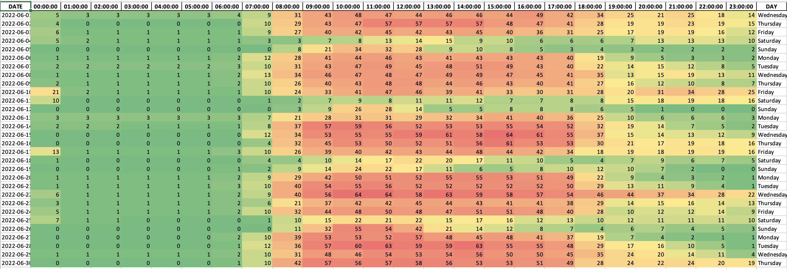

# carpark_analytics
A short script to generate an excel heatmap to show the number of cars in a carpark at a certain period of time.

## How to use:
1. Run the generateHeatmap.py script
2. Enter the carpark number (1-3)
3. Heatmaps will be generated. Find them in the ```output_files/heatmap``` folder.

## Sample Heatmap generated
